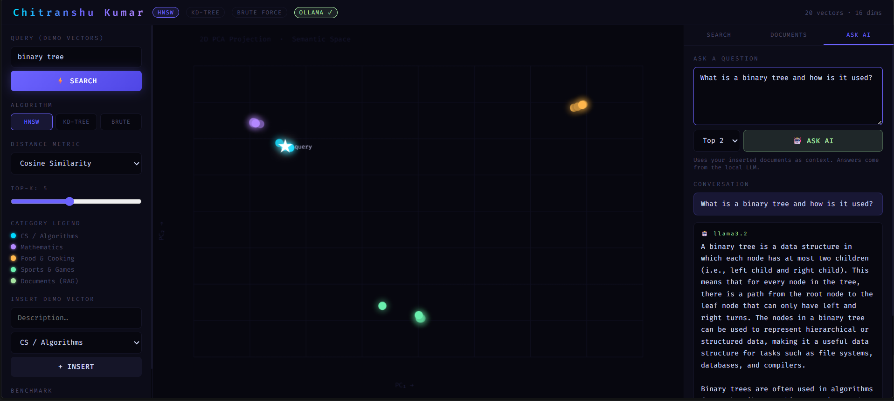

# ⚡ VectorDB RAG Engine

<div align="center">

### A C++17 Vector Database + Semantic Search + Local RAG System

**Built with Brute Force, KD-Tree, HNSW, Ollama Embeddings and Llama 3.2**


</div>

---

## 📌 Overview

**VectorDB RAG Engine** is a C++17-based vector database and Retrieval-Augmented Generation (RAG) system.

The project combines a custom vector search engine with locally running AI models through **Ollama**.

It supports:

- Vector storage
- Brute Force nearest-neighbor search
- KD-Tree search
- HNSW approximate nearest-neighbor search
- Euclidean, Cosine, and Manhattan distance metrics
- Document chunking
- Semantic search
- Local text embeddings
- Retrieval-Augmented Generation
- REST APIs
- Browser-based frontend

The complete system runs locally without requiring a cloud AI API.

---

# 🖥️ Project Preview

### 🤖 Local RAG with Ollama

The interface demonstrates semantic retrieval and local LLM-based question answering using `nomic-embed-text` and `llama3.2`.



> Question → Vector Retrieval → Relevant Context → llama3.2 → Generated Answer

---

## ✨ Features

### 🗄️ Vector Database

- Custom vector storage implemented in C++
- Dynamic document insertion
- Document deletion
- Document listing
- Vector metadata management

### 🔎 Vector Search

Three search approaches are implemented:

- **Brute Force**
- **KD-Tree**
- **HNSW**

Supported distance metrics:

- Euclidean
- Cosine
- Manhattan

### 📚 Document RAG

- Text document ingestion
- Automatic text chunking
- Embedding generation
- Semantic retrieval
- Top-K relevant chunk retrieval
- Context-aware LLM generation

### 🤖 Local AI

Powered by Ollama:

| Model | Purpose |
|---|---|
| `nomic-embed-text` | Text embeddings |
| `llama3.2` | Answer generation |

The current embedding pipeline produces **768-dimensional vectors**.

### 🌐 Web Interface

The project includes a browser-based frontend that communicates with the C++ backend through REST APIs.

---

# 🧠 System Architecture

```text
                         ┌─────────────────────┐
                         │       Browser       │
                         │     index.html      │
                         └──────────┬──────────┘
                                    │
                                    │ HTTP
                                    ▼
                         ┌─────────────────────┐
                         │    C++ HTTP Server  │
                         │     cpp-httplib     │
                         └──────────┬──────────┘
                                    │
                 ┌──────────────────┼──────────────────┐
                 │                  │                  │
                 ▼                  ▼                  ▼
          ┌─────────────┐    ┌─────────────┐    ┌─────────────┐
          │ Vector      │    │ Document    │    │   Status /  │
          │ Search      │    │ RAG         │    │   Stats     │
          └──────┬──────┘    └──────┬──────┘    └─────────────┘
                 │                  │
       ┌─────────┼─────────┐        │
       │         │         │        ▼
       ▼         ▼         ▼   ┌───────────────┐
   Brute Force KD-Tree    HNSW │ Text Chunking │
                               └───────┬───────┘
                                       │
                                       ▼
                              ┌──────────────────┐
                              │     Ollama       │
                              │ nomic-embed-text │
                              └────────┬─────────┘
                                       │
                                       ▼
                              ┌──────────────────┐
                              │  Vector Embedding│
                              │    768-D Vector  │
                              └────────┬─────────┘
                                       │
                                       ▼
                              ┌──────────────────┐
                              │ Semantic Search  │
                              └────────┬─────────┘
                                       │
                                       ▼
                              ┌──────────────────┐
                              │ Relevant Context │
                              └────────┬─────────┘
                                       │
                                       ▼
                              ┌──────────────────┐
                              │     llama3.2     │
                              └────────┬─────────┘
                                       │
                                       ▼
                              ┌──────────────────┐
                              │   Final Answer   │
                              └──────────────────┘
🔄 RAG Pipeline

The document question-answering process follows this pipeline:

                  DOCUMENT
                      │
                      ▼
               Text Chunking
                      │
                      ▼
             nomic-embed-text
                      │
                      ▼
              768-D Embedding
                      │
                      ▼
                DocumentDB
                      │
                      ▼
              Vector Retrieval
                      │
                      ▼
                Top-K Chunks
                      │
                      ▼
              Prompt Construction
                      │
                      ▼
                  llama3.2
                      │
                      ▼
               Generated Answer
Example

User asks:

What is a binary tree?

The system:

Converts the question into an embedding.
Searches the stored document vectors.
Retrieves the most semantically relevant chunks.
Builds a prompt containing the retrieved information.
Sends the prompt to llama3.2.
Returns the generated answer.
🔍 Vector Search Algorithms
1. Brute Force

Brute Force compares the query vector against stored vectors directly.

Query Vector
     │
     ├──── Compare → Vector 1
     ├──── Compare → Vector 2
     ├──── Compare → Vector 3
     ├──── Compare → Vector 4
     ├──── ...
     └──── Compare → Vector N

It provides a straightforward exact-search baseline.

2. KD-Tree

KD-Tree organizes multidimensional data using a tree-based spatial partitioning structure.

It can reduce the amount of the search space that needs to be examined compared with a direct exhaustive scan in suitable workloads.

3. HNSW

HNSW (Hierarchical Navigable Small World) is a graph-based approximate nearest-neighbor search technique.

The implementation creates a navigable graph structure that allows the search to move through candidate vectors rather than exhaustively comparing every stored vector.

For the document-search pipeline, the implementation switches between Brute Force and HNSW based on the configured document-count threshold.

📐 Distance Metrics

The VectorDB supports three distance metrics:

Metric	Purpose
Euclidean	Geometric distance between vectors
Cosine	Measures directional similarity
Manhattan	Sum of absolute coordinate differences

The document semantic-search pipeline uses Cosine distance.

For cosine distance:

Lower distance indicates greater similarity.

🤖 Ollama Integration

The project uses Ollama to run AI models locally.

Embedding Model
nomic-embed-text

Purpose:

Text
  ↓
nomic-embed-text
  ↓
768-dimensional vector
Generation Model
llama3.2

Purpose:

Retrieved Context + Question
          ↓
       llama3.2
          ↓
      Final Answer

This allows the complete RAG workflow to run locally.

📡 REST API

The backend exposes REST endpoints for document management, semantic search, RAG, and system information.

📥 Insert Document
Endpoint
POST /doc/insert
Request
{
  "title": "Binary Tree",
  "text": "A binary tree is a tree data structure where each node has at most two children."
}
Pipeline
Text
 ↓
Chunking
 ↓
Embedding
 ↓
VectorDB
🔎 Semantic Search
Endpoint
POST /doc/search
Request
{
  "question": "What is a binary tree?",
  "k": 3
}

Returns the most relevant document chunks and their vector distances.

🧠 RAG Question Answering
Endpoint
POST /doc/ask
Request
{
  "question": "What is a binary tree?",
  "k": 3
}
Pipeline
Question
   ↓
Embedding
   ↓
Vector Search
   ↓
Top-K Context
   ↓
Prompt
   ↓
llama3.2
   ↓
Answer
📋 List Documents
Endpoint
GET /doc/list

Returns stored document chunks and metadata.

🗑️ Delete Document
Endpoint
DELETE /doc/delete/:id

Example:

DELETE /doc/delete/1
❤️ System Status
Endpoint
GET /status

Returns information such as:

Ollama availability
Embedding model
Generation model
Document count
Embedding dimensions

Example:

{
  "ollamaAvailable": true,
  "embedModel": "nomic-embed-text",
  "genModel": "llama3.2",
  "docCount": 10,
  "docDims": 768
}
📊 Statistics
Endpoint
GET /stats

Returns information about:

Vector count
Vector dimensions
Search algorithms
Distance metrics
🛠️ Tech Stack
Technology	Role
C++17	Core VectorDB and backend
cpp-httplib	HTTP server/client
HNSW	Approximate nearest-neighbor search
KD-Tree	Spatial vector indexing
Brute Force	Exact-search baseline
Ollama	Local AI runtime
nomic-embed-text	Text embedding generation
llama3.2	LLM answer generation
HTML	Frontend
CSS	Frontend styling
JavaScript	Frontend logic
📁 Project Structure
VectorDB-RAG-Engine/
│
├── main.cpp          # C++ VectorDB + REST backend
├── index.html        # Web interface
├── httplib.h         # HTTP library
├── README.md         # Project documentation
└── .gitignore        # Git exclusions

Build artifacts and temporary files are intentionally excluded from the repository.

⚙️ Requirements

Before running the project, install:

Windows
C++17 compatible compiler
MinGW / GCC
Ollama
🚀 Installation & Setup
1. Clone the repository
git clone https://github.com/YOUR_USERNAME/VectorDB-RAG-Engine.git
cd VectorDB-RAG-Engine

Replace YOUR_USERNAME with your GitHub username.

2. Install Ollama

Install Ollama on your system and verify:

ollama --version
3. Download AI Models

Download the embedding model:

ollama pull nomic-embed-text

Download the generation model:

ollama pull llama3.2

Verify:

ollama list

You should see both models.

🔨 Build

From the project directory:

g++ -std=c++17 main.cpp -o main.exe -lws2_32
▶️ Run

Start the C++ server:

./main.exe

Expected startup information:

=== VectorDB Engine ===

http://localhost:8080

Ollama: ONLINE
embed model: nomic-embed-text
gen model: llama3.2

Open your browser:
http://localhost:8080

🧪 Testing
Check Ollama / Server Status
Invoke-RestMethod -Uri "http://localhost:8080/status"
Insert a Document
Invoke-RestMethod -Uri "http://localhost:8080/doc/insert" `
  -Method POST `
  -ContentType "application/json" `
  -Body '{"title":"Binary Tree","text":"A binary tree is a tree data structure where each node has at most two children."}'
Search the Document
Invoke-RestMethod -Uri "http://localhost:8080/doc/search" `
  -Method POST `
  -ContentType "application/json" `
  -Body '{"question":"What is a binary tree?","k":3}'
Ask a RAG Question
Invoke-RestMethod -Uri "http://localhost:8080/doc/ask" `
  -Method POST `
  -ContentType "application/json" `
  -Body '{"question":"What is a binary tree?","k":3}'
📊 Current Demonstrated Capabilities

The project has been tested with:

✅ C++ VectorDB backend
✅ REST API
✅ Browser frontend
✅ Document insertion
✅ Text chunking
✅ 768-dimensional embeddings
✅ Ollama integration
✅ Semantic document retrieval
✅ Brute Force retrieval
✅ HNSW retrieval path
✅ Document deletion
✅ RAG question answering
✅ Local LLM generation


💡 Why Build a Vector Database?
Traditional keyword search primarily depends on matching words.

Vector search represents text as numerical vectors and retrieves information according to semantic similarity.

For example:
Stored:
"Stacks follow the Last-In-First-Out principle."

Query:
"Which data structure uses LIFO?"

Vector search can identify the semantic relationship
between these two statements even when their wording differs.

This project demonstrates the core infrastructure behind semantic retrieval systems and RAG applications.

🔬 Performance Evaluation

Performance benchmarking is planned as a future stage of the project.

Potential evaluations include:

Brute Force vs KD-Tree vs HNSW latency
Search performance at larger vector counts
Average query latency
Recall@K
Index construction time
Memory usage

No benchmark numbers are claimed here until they are measured under controlled conditions.

⚠️ Current Limitations

This project is currently designed primarily as a learning, experimentation, and portfolio project.

Current limitations include:

Vector data is stored in memory.
Restarting the server clears the current document database.
Ollama must be installed and running locally.
AI models are downloaded separately through Ollama.
The current system is not publicly deployed.
Production-level authentication and security are not implemented.
Large-scale performance benchmarking is still planned.

🚧 Future Improvements
 Persistent vector storage
 Larger-scale benchmarking
 Recall@K evaluation
 Configurable HNSW parameters
 Batch document ingestion
 Improved chunking strategies
 Concurrent query processing
 Better JSON parsing and validation
 Authentication and API security
 Docker support
 Public/cloud deployment
 More extensive automated testing

🎯 Learning Objectives

This project was built to understand how modern semantic-search and RAG systems work internally.

Key concepts explored:

Vector representations
Embeddings
Nearest-neighbor search
Spatial indexing
Graph-based indexing
HNSW
KD-Trees
Cosine similarity
Text chunking
Semantic retrieval
REST API design
Local LLM integration
RAG architecture

👨‍💻 Author
Chitranshu Kumar
CSE(AIML)

Interests:
C++
Data Structures & Algorithms
Artificial Intelligence
Machine Learning
Vector Databases
Retrieval-Augmented Generation
Backend Development
Software Engineering

⭐ Project Summary
                ┌───────────────────────┐
                │       Documents       │
                └───────────┬───────────┘
                            ↓
                     Text Chunking
                            ↓
                    Ollama Embeddings
                            ↓
                       VectorDB
                            ↓
             ┌──────────────┼──────────────┐
             ↓              ↓              ↓
         Brute Force     KD-Tree          HNSW
             └──────────────┼──────────────┘
                            ↓
                     Semantic Search
                            ↓
                    Relevant Context
                            ↓
                         llama3.2
                            ↓
                      RAG Response
📜 License

This project is intended for educational and personal use.

---

<div align="center">

## ⚡ VectorDB RAG Engine

**C++17 · Vector Search · HNSW · Ollama · RAG**

<br>

Built by **Chitranshu Kumar**

<br>

<sub>© 2026 Chitranshu Kumar · Educational & Portfolio Project</sub>

</div>

---
